# Hi there, I'm Prashanth Kumar Bollinedi 👋

<div align="center">
  


### Aspiring Software Engineer | Competitive Programmer | Full Stack Developer

[](https://linkedin.com/in/prasanth-kumar-bollinedi)
[](https://prasanth-bollinedi-portfolio.vercel.app/)
[](mailto:prashanthbollinedi2910@gmail.com)
[](https://leetcode.com/u/prashanth_d4)
[](https://codeforces.com/profile/prashanth_2327)


</div>

---

## 🚀 About Me

I'm a passionate software engineer with a strong foundation in algorithms and a keen interest in building scalable, full-stack applications. Whether it's solving complex DSA problems or crafting end-to-end web solutions, I thrive on turning ideas into reality through clean, efficient code.

```Java
public class Prasanth {

    public static void main(String[] args) {

        BackendEngineer me = BackendEngineer.builder()

                .withLanguage("Java")
                .withFramework("Spring Boot")
                .withDatabase("PostgreSQL")
                .withCache("Redis")
                .withMessaging("Kafka")
                .withContainerization("Docker")

                .interestedIn(
                        "Distributed Systems",
                        "System Design",
                        "Competitive Programming")

                .currentlyLearning(
                        "Microservices",
                        "Cloud",
                        "Scalable Architecture")

                .build();

        me.keepLearning();
        me.build();
        me.solveProblems();
    }
}
```
# 🚀 What I'm Currently Doing

- ☕ Building backend applications with **Java & Spring Boot**
- 🏗️ Learning **System Design** and **Distributed Systems**
- ⚡ Exploring **Microservices**, **Kafka**, and **Redis**
- 📚 Practicing **Data Structures & Algorithms**
- 🚀 Building production-ready backend projects
- 🤝 Open to collaborating on backend-focused open-source projects


---

## 🛠️ Technical Skills

### Programming Languages
<div align="center">


</div>

### Backend Development
<div align="center">


</div>

### Frontend Development
<div align="center">


</div>

### Data Science & ML
<div align="center">


</div>

### Database & Tools
<div align="center">


</div>

---

## 📊 Competitive Programming Achievements

<div align="center">
  <table>
    <tr>
      <td valign="top" width="50%">
        <a href="https://leetcode.com/u/prashanth_d4">
          
        </a>
      </td>
      <td valign="top" width="50%">
        <a href="https://codeforces.com/profile/prashanth_2327">
          
        </a>
      </td>
    </tr>
  </table>
</div>

---

## 🌟 Core Expertise & GitCity

<div align="center">

<table>
<tr>
<td align="center" width="50%">

### 📊 Core Expertise



</td>

<td align="center" width="50%">

### 🏙️ GitCity


</td>
</tr>
</table>

</div>

## 📫 Let's Connect

I'm always open to interesting conversations, collaboration opportunities, and new challenges. Whether it's discussing algorithms, full-stack architecture, or potential projects, feel free to reach out!

<div align="center">

[](https://linkedin.com/in/prasanth-kumar-bollinedi)
[](https://prasanth-bollinedi-portfolio.vercel.app/)
[](mailto:prashanthbollinedi2910@gmail.com)

</div>

---

<div align="center">

### 💭 Quote I Live By

*"First, solve the problem. Then, write the code." - John Johnson*


**Thanks for visiting! Let's build the future together! 🚀**

</div>
